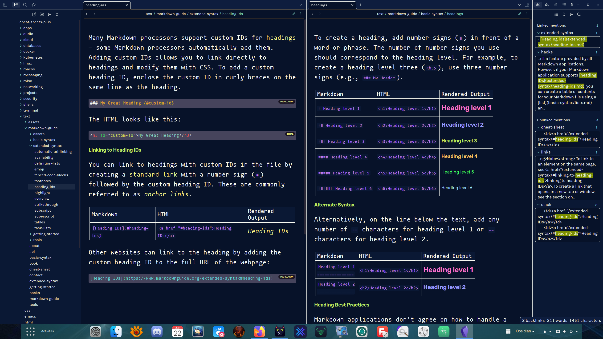

<h1 align="center">Obsidian Theme: Doctorfree</h1>

<div align="center">

v1.x | Designed & Coded with 💎 by Dr. Ronald Joe Record <br>
This custom theme is designed for use with the [Obsidian](https://obsidian.md/)
notes application.

  <p align="center">
  [](https://opensource.org/licenses/MIT)
  </p>

**[CHANGES](https://github.com/doctorfree/Obsidian-Doctorfree/blob/main/CHANGELOG.md)** | **[OBSIDIAN FORUM](https://forum.obsidian.md/)** | **[USAGE](#usage)**

</div>

<br />

## Usage

```
mkdir -p .../.obsidian/themes/Doctorfree
cp manifest.json .../.obsidian/themes/Doctorfree/manifest.json
cp doctorfree.css .../.obsidian/themes/Doctorfree/theme.css
```

## Obsidian plus NB

The open source [command line tool nb](https://github.com/xwmx/nb) is another
powerful knowledge base application. Obsidian and nb can be used together to
provide an even more powerful, rich, flexible, cross-platform knowledge base.
In addition to note-taking, nb provides features like bookmarking, archiving,
encryption, filtering, format conversion, todos with tasks, and more.

Both nb and Obsidian utilize plain text data storage in Markdown format.
Both sync across platforms with `git`. They complement one another and work
well together. For example, to create an nb notebook from an existing Obsidian
vault (or any repository with markdown):

```
nb notebooks add cheat-sheets https://github.com/doctorfree/cheat-sheets.git
```

This would create an nb notebook named 'cheat-sheets'. The 'cheat-sheets' nb
notebook is just a clone of the specified Github repository. If that repository
were an Obsidian vault then changes/updates to the Obsidian vault can now be
made in either Obsidian or nb. All changes will automatically sync and be
available across all platforms where either Obsidian or nb is deployed.

## Obsidian license restriction

Obsidian is free for personal use. However, the license includes a restriction
on the use of Obsidian for revenue generating activities. Here is the relevant
section from the Obsidian license:

```
You need to pay for Obsidian if and only if you use it to contribute, directly
or indirectly, to revenue-generating, work-related activities in a company that
has two or more people.
```

The `nb` note-taking command line application has no such restriction and is
completely free and open source software licensed under the GNU Affero General
Public License v3.0.
