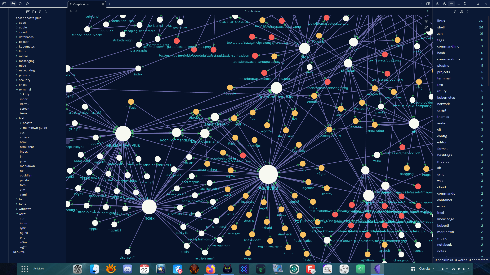

<h1 align="center">Obsidian Theme: Doctorfree</h1>

<div align="center">

v1.x | Designed & Coded with 💎 by Dr. Ronald Joe Record <br>
This custom theme is designed for use with [Obsidian](https://obsidian.md/)<br>
⚡ Inspired by the [Night Owl theme](https://github.com/bencodezen/obsidian-night-owl-theme) by [Ben Hong](https://twitter.com/bencodezen) and the [Obsidianite theme](https://github.com/bennyxguo/Obsidian-Obsidianite) by [Benny Guo](https://twitter.com/bennyxguo).

**[CHANGES](https://github.com/doctorfree/Obsidian-Doctorfree/blob/main/CHANGELOG.md)** | **[OBSIDIAN FORUM](https://forum.obsidian.md/)** | **[INSTALL](#installation)**

</div>

[](https://opensource.org/licenses/MIT)

<br />

<br />

## 📥 Installation

### Obsidian Marketplace (Recommended)

1. Open the **Settings** in Obsidian
1. Navigate to **Appearances** tab under **Options**
1. Under the **Themes** section, click on the `Browse` button next to **Community Themes**
1. Search for `Doctorfree` in the Filter text input in the upper left corner
1. Click `Use` and then you're done! 🎉

### Manual

```
mkdir -p .../.obsidian/themes/Doctorfree
cp manifest.json .../.obsidian/themes/Doctorfree/manifest.json
cp doctorfree.css .../.obsidian/themes/Doctorfree/theme.css
```

1. Open the **Settings** in Obsidian
1. Navigate to **Appearances** tab under **Options**
1. Under the **Themes** section, click on the dropdown menu next to **Theme** heading
1. Select for `Doctorfree` and then you're done! 🎉'

### 👩‍💻 Local Dev Environment

This is for people who want to clone the repo and work with the file locally.

1. Clone the repo
2. Install dependencies (`npm install`)
3. Create `.env` with a file path to where your theme directory lives
    - Use `.env-sample` to see the format.
4. Run `npm start`

All changes made to SCSS files will automatically be migrated into your Obsidian environment.

## FAQ

### How do I customize this theme?

#### Easiest: Use [Obsidian Style Settings Plugin](https://github.com/mgmeyers/obsidian-style-settings)

This allows you to configure the theme directly in Obsidian without any CSS knowledge required!

More settings to come, but if you have specific requests, please [open an issue here](https://github.com/doctorfree/Obsidian-Doctorfree/issues/new)!

#### Intermediate: Add CSS snippets

Check out CSS snippets as a way to progressively enhance the theme.

Here's a [useful forum post](https://forum.obsidian.md/t/how-to-achieve-css-code-snippets/8474) to help get you started.

> 🎩 Thanks to the suggestion by @DutchPete!

#### Hard: Create a fork of this theme

This is arguably the most reliable route, but will require some familiarity with coding.

I recommend using [Node.js](https://nodejs.org/en/) so you can leverage the [Sass](https://sass-lang.com/) I'm starting to break out so you can make meaningful changes.

The Sass partials are will a work in progress though, so the way things are organized will probably change over time as I establish out better ways to structure how theming styles should be organized.

## Typography

### Preview Mode

When in preview mode, the typography is inspired by a dual font family system to easily distinguish between headings and regular text.

- Headings: [Rubik](https://fonts.google.com/specimen/Rubik)
- Body: [Karla](https://fonts.google.com/specimen/Karla)

### Editor Mode

When in edit mode, the typography is inspired from a developer like environment where you're "coding" your second-brain.

- [IBM Plex Mono](https://fonts.google.com/specimen/IBM+Plex+Mono)

## Obsidian plus NB

The open source [command line tool nb](https://github.com/xwmx/nb) is another
powerful knowledge base application. Obsidian and nb can be used together to
provide an even more powerful, rich, flexible, cross-platform knowledge base.
In addition to note-taking, nb provides features like bookmarking, archiving,
encryption, filtering, format conversion, todos with tasks, and more.

Both nb and Obsidian utilize plain text data storage in Markdown format.
Both sync across platforms with `git`. They complement one another and work
well together. For example, to create an nb notebook from an existing Obsidian
vault (or any repository with markdown):

```
nb notebooks add cheat-sheets https://github.com/doctorfree/cheat-sheets.git
```

This would create an nb notebook named 'cheat-sheets'. The 'cheat-sheets' nb
notebook is just a clone of the specified Github repository. If that repository
were an Obsidian vault then changes/updates to the Obsidian vault can now be
made in either Obsidian or nb. All changes will automatically sync and be
available across all platforms where either Obsidian or nb is deployed.

## Obsidian license restriction

Obsidian is free for personal use. However, the license includes a restriction
on the use of Obsidian for revenue generating activities. Here is the relevant
section from the Obsidian license:

```
You need to pay for Obsidian if and only if you use it to contribute, directly
or indirectly, to revenue-generating, work-related activities in a company that
has two or more people.
```

The `nb` note-taking command line application has no such restriction and is
completely free and open source software licensed under the GNU Affero General
Public License v3.0.

## Credit

🎩 Hat tip to the [Night Owl theme](https://github.com/bencodezen/obsidian-night-owl-theme) and the [Obsidianite theme](https://github.com/bennyxguo/Obsidian-Obsidianite) for serving as the base themes I used to create this theme.
