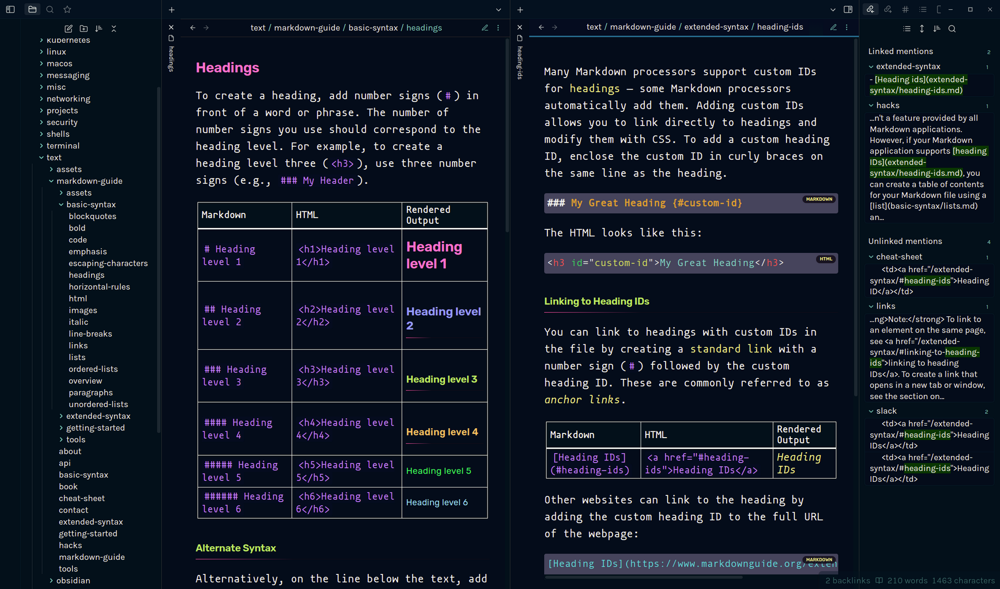
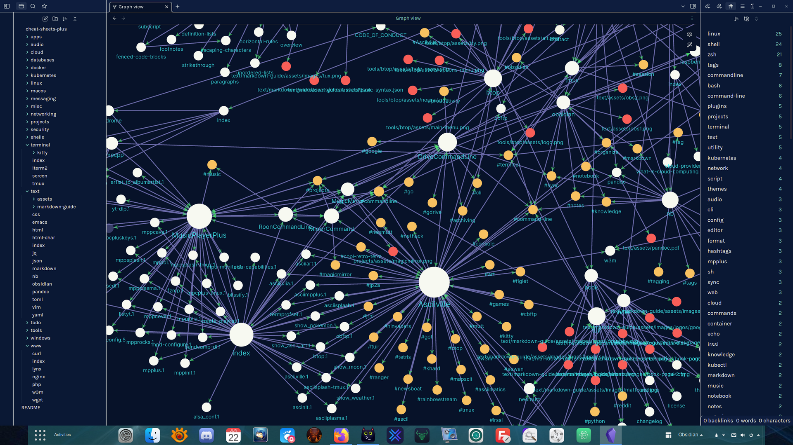

<h1 align="center">Obsidian Theme: Doctorfree</h1>

<div align="center">

v1.x | Designed & Coded with 💎 by Dr. Ronald Joe Record <br>
This custom theme is designed for use with [Obsidian](https://obsidian.md/)<br>
⚡ Inspired by the [Night Owl theme](https://github.com/bencodezen/obsidian-night-owl-theme) by [Ben Hong](https://twitter.com/bencodezen) and the [Obsidianite theme](https://github.com/bennyxguo/Obsidian-Obsidianite) by [Benny Guo](https://twitter.com/bennyxguo)<br>
[](https://opensource.org/licenses/MIT)

**[CHANGES](https://github.com/doctorfree/Obsidian-Doctorfree/blob/main/CHANGELOG.md)** | **[OBSIDIAN FORUM](https://forum.obsidian.md/)** | **[INSTALL](#installation)**

</div>

## Table of Contents

- [Screenshots](#screenshots)
- [Installation](#installation)
- [Obsidian Settings](#obsidian-settings)
- [Local Dev Environment](#local-dev-environment)
- [Recommended Obsidian Community plugins](#recommended-obsidian-community-plugins)
- [FAQ](#faq)
- [Typography](#typography)
- [Obsidian plus NB](#obsidian-plus-nb)
- [Obsidian license restriction](#obsidian-license-restriction)
- [Credit](#credit)

## Screenshots

<br />

<br />

## Installation

### Obsidian Marketplace

1. Open the **Settings** in Obsidian
1. Navigate to **Appearances** tab under **Options**
1. Under the **Themes** section, click on the `Browse` or `Manage` button
1. Search for `Doctorfree` in the Filter text input in the upper left corner
1. Click `Use this theme` and you're done! 🎉

### Manual

```shell
git clone https://github.com/doctorfree/Obsidian-Doctorfree.git
cd Obsidian-Doctorfree
mkdir -p /path/to/vault/.obsidian/themes/Doctorfree
cp manifest.json /path/to/vault/.obsidian/themes/Doctorfree/manifest.json
cp theme.css /path/to/vault/.obsidian/themes/Doctorfree/theme.css
```

1. Open the **Settings** in Obsidian
1. Navigate to **Appearances** tab under **Options**
1. Under the **Themes** section, click on the dropdown menu next to **Theme** heading
1. Select for `Doctorfree` and then you're done! 🎉'

## Obsidian Settings

- `Settings -> Appearance -> Basic color scheme`: *Dark*
- `Settings -> Appearance -> Themes`: *Doctorfree*

### Optional Obsidian Settings

- `Settings -> Appearance -> Font`:
    - I use *Mononoki Nerd Font* and *Mononoki Nerd Font Mono*
    - The default font size in Obsidian is too small, I bump it up to 24
- `Settings -> Appearance -> Advanced`: Disable *Show inline title*
- `Settings -> Editor -> Default view for new tabs`: *Reading view*

## Local Dev Environment

This is for people who want to clone the repo and work with the file locally.

1. Clone the repo
2. Install dependencies (`npm install`)
3. Create `.env` with a file path to where your theme directory lives
    - Use `.env-sample` to see the format.
4. Run `npm run setup`
5. Run `npm start`

All changes made to SCSS files will automatically be migrated into your Obsidian environment.

## Recommended Obsidian Community plugins

This Obsidian theme has been configured for use with the [Style Settings](https://github.com/mgmeyers/obsidian-style-settings) community plugin. The theme CSS includes comments that enable easy customization of colors, fonts, and additional typography. This is an optional feature and can be enabled by installing the Style Settings plugin.

Obsidian community plugins we have found useful and can recommend include the following:

- [Dataview](https://github.com/blacksmithgu/obsidian-dataview): Treats an Obsidian Vault as a database from which you can query
- [Pandoc](https://github.com/OliverBalfour/obsidian-pandoc): Adds command palette options to export your notes to a variety of formats
- [Contextual Typography](https://github.com/mgmeyers/obsidian-contextual-typography): Enables enhanced preview typography
- [Hider](https://github.com/kepano/obsidian-hider): Hides various elements of the UI
- [Style Settings](https://github.com/mgmeyers/obsidian-style-settings): Enables theme customization
- [Tag Wrangler](https://github.com/pjeby/tag-wrangler): Adds a context menu for tags in the Obsidian tag pane

## FAQ

### How do I customize this theme?

#### Easiest: Use [Obsidian Style Settings Plugin](https://github.com/mgmeyers/obsidian-style-settings)

This allows you to configure the theme directly in Obsidian without any CSS knowledge required!

If you have specific requests, please [open an issue here](https://github.com/doctorfree/Obsidian-Doctorfree/issues/new)!

#### Intermediate: Add CSS snippets

Check out CSS snippets as a way to progressively enhance the theme.

Here's a [useful forum post](https://forum.obsidian.md/t/how-to-achieve-css-code-snippets/8474) to help get you started.

> 🎩 Thanks to the suggestion by @DutchPete!

#### Hard: Create a fork of this theme

This is arguably the most reliable route, but will require some familiarity with coding.

I recommend using [Node.js](https://nodejs.org/en/) so you can leverage the [Sass](https://sass-lang.com/) and make meaningful changes.

The Sass partials are a work in progress and may change over time.

## Typography

### Preview Mode

When in preview mode, the typography is inspired by a dual font family system to easily distinguish between headings and regular text.

- Headings: [Rubik](https://fonts.google.com/specimen/Rubik)
- Body: [Karla](https://fonts.google.com/specimen/Karla)

### Editor Mode

When in edit mode, the typography is inspired from a developer like environment where you're "coding" your second-brain.

- [IBM Plex Mono](https://fonts.google.com/specimen/IBM+Plex+Mono)

## Obsidian plus NB

The open source [command line tool nb](https://github.com/xwmx/nb) is another
powerful knowledge base application. Obsidian and nb can be used together to
provide an even more powerful, rich, flexible, cross-platform knowledge base.
In addition to note-taking, nb provides features like bookmarking, archiving,
encryption, filtering, format conversion, todos with tasks, and more.

Both nb and Obsidian utilize plain text data storage in Markdown format.
Both sync across platforms with `git`. They complement one another and work
well together. For example, to create an nb notebook from an existing Obsidian
vault (or any repository with markdown):

```shell
nb notebooks add cheat-sheets https://github.com/doctorfree/cheat-sheets.git
```

This would create an nb notebook named 'cheat-sheets'. The 'cheat-sheets' nb
notebook is just a clone of the specified Github repository. If that repository
were an Obsidian vault then changes/updates to the Obsidian vault can now be
made in either Obsidian or nb. All changes will automatically sync and be
available across all platforms where either Obsidian or nb is deployed.

## Obsidian license restriction

Obsidian is free for personal use. However, the license includes a restriction
on the use of Obsidian for revenue generating activities. Here is the relevant
section from the Obsidian license:

```text
You need to pay for Obsidian if and only if you use it to contribute, directly
or indirectly, to revenue-generating, work-related activities in a company that
has two or more people.
```

The `nb` note-taking command line application has no such restriction and is
completely free and open source software licensed under the GNU Affero General
Public License v3.0.

## Credit

🎩 Hat tip to the [Night Owl theme](https://github.com/bencodezen/obsidian-night-owl-theme) and the [Obsidianite theme](https://github.com/bennyxguo/Obsidian-Obsidianite) for serving as the base themes I used to create this theme.
